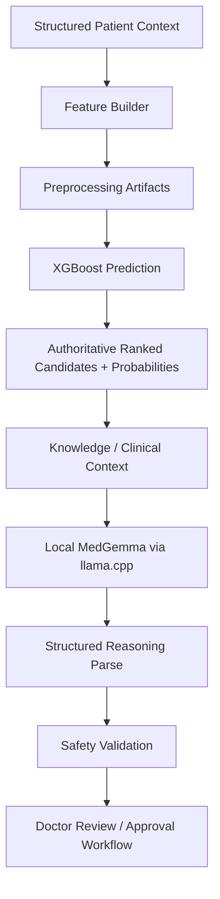
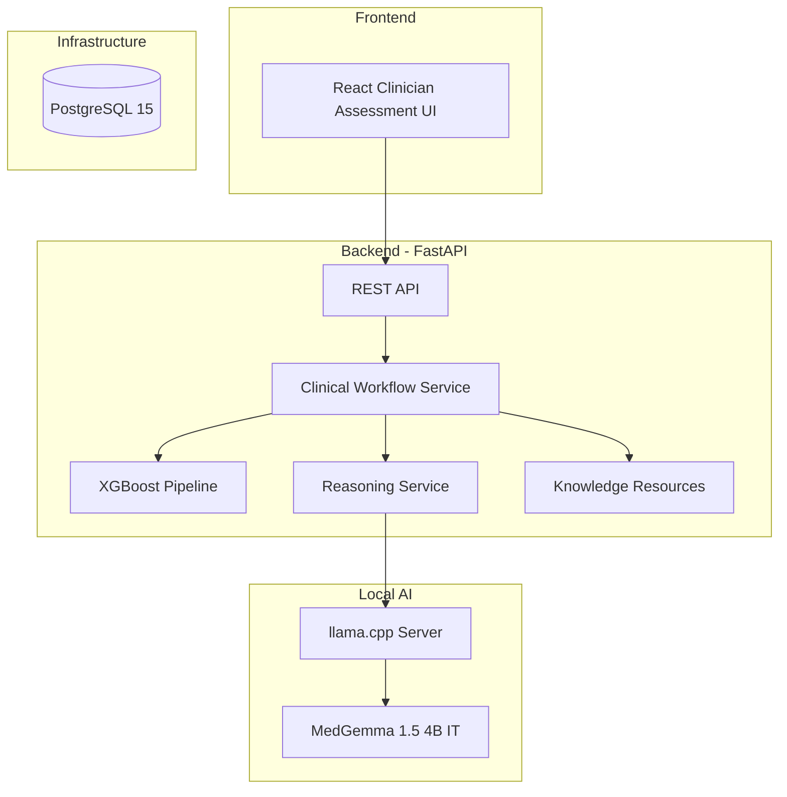

# MedIntel

### AI-Powered Clinical Decision Support System

> **Empowering clinicians with intelligent, evidence-based decision support — where artificial intelligence informs and the doctor decides.**

---

[](LICENSE)
[]()
[](https://fastapi.tiangolo.com)
[]()
[](https://xgboost.readthedocs.io)
[]()
[](https://www.postgresql.org)
[](https://www.docker.com)

---

## Table of Contents

- [Project Description](#project-description)
- [Vision](#vision)
- [Why MedIntel](#why-medintel)
- [Key Features](#key-features)
- [Clinical Workflow](#clinical-workflow)
- [AI Pipeline](#ai-pipeline)
- [System Architecture Overview](#system-architecture-overview)
- [Technology Stack](#technology-stack)
- [Project Structure](#project-structure)
- [Getting Started](#getting-started)
- [Installation](#installation)
- [Development Workflow](#development-workflow)
- [Roadmap](#roadmap)
- [Documentation](#documentation)
- [Security & Privacy Philosophy](#security--privacy-philosophy)
- [Contribution Guidelines](#contribution-guidelines)
- [License](#license)
- [Contact](#contact)

---

## Project Description

**MedIntel** is an AI-powered Clinical Decision Support System (CDSS) designed to assist licensed healthcare professionals with structured clinical decision support.

The current prototype combines an **XGBoost** differential-diagnosis model with **Google MedGemma 1.5 4B IT running locally through llama.cpp**.

XGBoost remains the authoritative ranking component. MedGemma receives the already-ranked candidates and produces constrained clinical reasoning without adding, removing, re-ranking, or changing the model probabilities.

> **Clinical Disclaimer:** MedIntel is a decision-support prototype only. It does not autonomously diagnose, prescribe, order medication, or determine patient disposition. All final clinical decisions remain with the treating clinician.

## Phase 8 Technical Acceptance Status

MedIntel has completed its bounded **Phase 8 integrated technical acceptance** as a respiratory clinical decision-support research prototype.

The accepted Phase 8 baseline includes the clinician-facing assessment workflow, local single-clinician JWT authentication boundary, protected clinical APIs, production Nginx frontend serving, health-gated Docker Compose orchestration, restart/recovery checks, and a minimal GitHub CI gate.

This is **not clinical validation or production-clinical certification**. The research workflow uses synthetic DDXPlus v6.2 data; Phase 7 Track-A 7.5F remains incomplete and A5 remains `NOT_ASSESSED`. The local authentication boundary is not production IAM. MedIntel does not autonomously establish a diagnosis or prescription, and the treating doctor retains the final clinical decision.

Phase 8 frozen technical status is documented in [`docs/validation/phase8/PHASE_8_TECHNICAL_ACCEPTANCE_REPORT.md`](docs/validation/phase8/PHASE_8_TECHNICAL_ACCEPTANCE_REPORT.md).

---

## Vision

Healthcare professionals face increasing cognitive load — managing complex patient histories, staying current with evolving clinical guidelines, and making high-stakes decisions under time pressure. Diagnostic errors remain a leading cause of preventable patient harm worldwide.

**MedIntel's vision** is to reduce that burden by putting a structured, evidence-informed AI assistant in every consulting room — one that surfaces relevant differentials, flags critical warning signs, and organizes clinical reasoning in a transparent, auditable way.

We believe AI in healthcare must be explainable, trustworthy, and deeply collaborative with the clinician — not a black box that replaces human expertise, but a reliable second opinion that enhances it.

---

## Why MedIntel

MedIntel is being designed around a narrow clinical decision-support role rather than autonomous medical decision-making.

| Design Need | Current MedIntel Approach |
|---|---|
| Structured differential support | XGBoost produces the authoritative ranked disease candidates and probabilities |
| Explainable clinician-facing context | Local MedGemma generates constrained reasoning from the existing ranked candidates |
| Protection against LLM ranking drift | Safety rules prevent MedGemma from adding, removing, re-ranking, or changing candidate probabilities |
| Local prototype inference | MedGemma runs locally through llama.cpp; the GGUF file remains outside Git |
| Reproducible engineering workflow | Docker Compose, a digest-pinned backend image, and a validated dependency lock are used |
| Human oversight | AI output is parsed and safety-validated, and doctor review remains mandatory |

The clinician-facing assessment frontend and local single-clinician authentication boundary are implemented. Application-level production patient-data persistence, broader knowledge-base validation, complete report workflows, production IAM, and clinical validation remain later work.

---

## Key Features

### Implemented

- Modular FastAPI backend with versioned clinical API endpoints
- XGBoost respiratory differential-diagnosis pipeline
- Trained disease-label mapping for model outputs
- Local MedGemma reasoning provider using llama.cpp
- Safety validation that preserves XGBoost candidates, ranks, and probabilities
- Structured doctor-review and approval workflow
- Clinical reasoning prompt packaged into the backend Docker image
- Four-service Docker Compose topology: `backend`, `medgemma`, `db`, and `frontend`
- Digest-pinned Python backend image
- Reproducible backend dependency constraints
- Automated backend test suite
- End-to-end engineering workflow verification

### In Progress

- Expansion and validation of clinical knowledge-base content
- Phase 4.6 documentation and second-machine collaboration verification

### Planned

- Further clinician-facing patient and report workflow expansion
- Application-level PostgreSQL persistence
- Production IAM, audit logging, and deployment access-control integration
- Broader clinical validation and model evaluation

- Patient management and longitudinal records
- Structured clinical report generation and export
- Analytics and clinical outcome tracking
- Follow-up and review scheduling recommendations
- Physiotherapy and rehabilitation support
- Referral and specialist escalation support
- Comprehensive medico-legal audit logging
- FHIR-compliant EHR/EMR interoperability

---

## Clinical Workflow

The currently verified **engineering workflow** is:



XGBoost remains authoritative for the ranked disease candidates and probabilities. MedGemma is used only for constrained clinical reasoning around those candidates.

The end-to-end workflow has been verified with synthetic engineering input. This verification is **not clinical validation** and does not establish diagnostic efficacy, treatment efficacy, regulatory approval, or production readiness.

---

## AI Pipeline

MedIntel currently uses a two-stage hybrid decision-support pipeline.


### ML Component - XGBoost

- Performs the authoritative disease ranking
- Uses trained preprocessing artifacts and respiratory model artifacts
- Returns ranked candidate diseases with probabilities
- Candidate names are mapped using the trained model metadata

### LLM Component - Local MedGemma

- Model identifier: `google/medgemma-1.5-4b-it`
- Current prototype inference is local through `llama.cpp`
- The GGUF model file is stored outside Git
- MedGemma receives existing XGBoost-ranked candidates
- It must not add, remove, re-rank, or change candidate probabilities
- Its output is parsed and safety-validated before being returned
- Doctor review remains mandatory

---

## System Architecture Overview



The currently verified backend and local-AI path runs through Docker Compose.

The PostgreSQL container is available as infrastructure, but application-level clinical persistence has **not yet been established**.

The frontend Docker service now serves the clinician-facing Phase 8 assessment interface through production Nginx; broader patient and report workflows remain incomplete.

---

## Technology Stack

| Layer | Current Technology | Status |
|---|---|---|
| Backend | FastAPI / Python 3.12.13 | Implemented |
| ML Model | XGBoost 3.2.0 | Implemented |
| ML Preprocessing | scikit-learn 1.6.1 | Implemented |
| Data Processing | pandas 2.3.3 | Implemented |
| Clinical Reasoning | MedGemma 1.5 4B IT | Implemented locally |
| LLM Runtime | llama.cpp server | Implemented locally |
| Containerization | Docker Compose | Implemented |
| Backend Dependency Reproducibility | `backend/constraints.txt` | Implemented |
| Database Infrastructure | PostgreSQL 15 Alpine | Container available; application persistence pending |
| Frontend | React + TypeScript + Nginx | Phase 8 assessment workflow implemented |
| Version Control | Git + GitHub | Implemented |

### Runtime Reproducibility

The backend Docker environment is intentionally reproducible:

- Python base image is pinned by immutable image digest.
- Training-critical runtime versions are aligned with recovered model-training provenance:
  - Python `3.12.13`
  - XGBoost `3.2.0`
  - scikit-learn `1.6.1`
  - pandas `2.3.3`
- `backend/constraints.txt` records the exact validated deployment dependency set.

The complete constraints file represents the **validated deployment environment**. It should not be interpreted as proof that every transitive dependency was present at the same version during original model training.

---

## Project Structure

Key paths in the current repository:

```text
MedIntel/
|-- backend/
|   |-- app/
|   |-- services/
|   |-- knowledge/
|   |-- models/
|   |-- tests/
|   |-- Dockerfile
|   |-- requirements.txt
|   `-- constraints.txt
|-- frontend/
|   |-- .gitkeep
|   `-- Dockerfile          # React + TypeScript clinician UI
|-- prompts/
|   `-- clinical_reasoning_v1.txt
|-- docs/
|-- notebooks/
|-- .dockerignore
|-- .env.example
|-- docker-compose.yml
`-- README.md
```

Large model files, local datasets, virtual environments, secrets, and `.env` are not intended for Git.

---

## Getting Started

### Prerequisites

For the currently validated Docker workflow:

| Requirement | Notes |
|---|---|
| Docker Desktop / Docker Engine with Compose | Required |
| Git | Required for repository workflow |
| MedGemma GGUF file | Stored locally outside Git |
| Python | Optional for local test execution |

No cloud AI SDK is required for the current local MedGemma inference path.

### Clone the Repository

```bash
git clone https://github.com/harshavardhanmalipeddi1-innovates/MedIntel.git
cd MedIntel
```

---

## Installation

### 1. Create the local environment file

Copy `.env.example` to `.env`.

PowerShell:

```powershell
Copy-Item .env.example .env
```

### 2. Configure the local MedGemma model path

Set `MEDGEMMA_MODEL_PATH` in `.env` to the local GGUF file.

Example:

```env
MEDGEMMA_MODEL_PATH=C:/Dev/Models/MedGemma/medgemma-1.5-4b-it-q4_0.gguf
```

Keep the GGUF file outside the repository. Do not commit it.

The Docker Compose configuration enables the local reasoning provider for the containerized workflow and connects the backend to the `medgemma` service internally.

### 3. Build and start the services

```bash
docker compose --env-file .env up -d --build
```

Current Compose services:

- `medgemma` - local llama.cpp inference server
- `backend` - FastAPI API
- `db` - PostgreSQL infrastructure
- `frontend` - production Nginx container serving the clinician-facing React UI

MedGemma may require several minutes to load on CPU-only development machines.

### 4. Backend API

After the backend starts:

- API health: `http://localhost:8000/health`
- Swagger UI: `http://localhost:8000/docs`
- ReDoc: `http://localhost:8000/redoc`

### Current Limitations

- The frontend contains the clinician-facing React assessment application; broader patient and report workflows remain incomplete.
- PostgreSQL is running as infrastructure, but application-level patient persistence is not yet claimed.
- The local MedGemma prototype is an engineering integration and has not itself established clinical efficacy or regulatory validation.

---

## Development Workflow

```bash
# Create a feature branch
git checkout -b feature/your-feature-name

# Make your changes
# ...

# Run tests
cd backend && pytest tests/

# Stage and commit
git add .
git commit -m "feat: describe your change clearly"

# Push and open a Pull Request
git push origin feature/your-feature-name
```

### Branch Naming Convention

| Prefix | Purpose |
|---|---|
| `feature/` | New features or enhancements |
| `fix/` | Bug fixes |
| `docs/` | Documentation updates |
| `refactor/` | Code restructuring without behaviour change |
| `chore/` | Maintenance tasks, dependency updates |

### Commit Message Convention

We follow [Conventional Commits](https://www.conventionalcommits.org/):

```
feat:     New feature
fix:      Bug fix
docs:     Documentation change
style:    Formatting (no logic change)
refactor: Code restructure
test:     Adding or updating tests
chore:    Maintenance
```

---

## Roadmap

### Version 1 - MVP

| Milestone | Status |
|---|---|
| Project architecture and repository setup | Complete |
| FastAPI backend API layer | Complete |
| XGBoost respiratory prediction service | Complete |
| Trained disease-label mapping | Complete |
| Local MedGemma reasoning integration | Complete |
| Reasoning safety validation | Complete |
| Docker backend / MedGemma integration | Complete |
| Reproducible backend Docker environment | Complete |
| Backend unit and integration test suite | Complete |
| Clinician-facing assessment frontend | Phase 8 - Implemented |
| Knowledge-base expansion | In Progress |
| PostgreSQL application persistence | Pending |
| Authentication / access control integration | Pending |

The completed end-to-end workflow checks are **engineering verification using synthetic test input**. They are not clinical validation.

### Version 2 - Clinical Expansion

- Patient management and longitudinal records
- Structured clinical report generation
- Role-based access control
- Investigation support with evidence links
- Follow-up and review workflows
- Physiotherapy and rehabilitation guidance
- Referral escalation criteria
- Audit logging
- Clinical analytics

### Version 3 - Enterprise & Interoperability

- FHIR-compliant EHR/EMR integration
- Production-scale orchestration
- ICD-10 and SNOMED CT terminology support
- Multi-tenant hospital deployment
- Model retraining and governance pipeline

---

## Documentation

Full project documentation is maintained in the [`/docs`](docs/) directory:

| Document | Description |
|---|---|
| [`architecture.md`](docs/architecture.md) | System design and component overview |
| [`api.md`](docs/api.md) | REST API endpoint reference |
| [`database.md`](docs/database.md) | Database schema and entity relationships |
| [`clinical_workflow.md`](docs/clinical_workflow.md) | End-to-end clinical workflow documentation |
| [`data_dictionary.md`](docs/data_dictionary.md) | Clinical feature definitions and data types |
| [`specs/MASTER_BLUEPRINT.md`](specs/MASTER_BLUEPRINT.md) | Master architecture blueprint |

---

## Security & Privacy Philosophy

MedIntel treats clinical safety, privacy, and clinician oversight as first-order requirements.

- The current MedGemma inference path is local.
- Secrets and local `.env` files must not be committed to Git.
- GGUF model files are stored outside the repository and mounted read-only into the MedGemma container.
- XGBoost remains authoritative for candidate ranking and probabilities.
- MedGemma is not permitted to independently add, remove, re-rank, or modify those candidates.
- AI reasoning output passes structured parsing and safety validation.
- Doctor review remains mandatory.
- MedIntel does not autonomously diagnose, prescribe, order medication, or determine disposition.
- PostgreSQL infrastructure is present, but production patient-data persistence and its security controls remain future work.
- Local single-clinician authentication and bounded deployment hardening are implemented for the research prototype. Production IAM, audit logging, retention policy, regulatory compliance, and production-clinical security validation remain required before any clinical deployment.

The existing prototype and engineering tests should not be interpreted as evidence of clinical validation, regulatory approval, or production readiness.

---

## Contribution Guidelines

MedIntel welcomes contributions from software engineers, clinical informaticists, data scientists, and healthcare professionals.

### How to Contribute

1. Fork the repository.
2. Create a feature branch from `main`.
3. Write clear, tested, and documented code.
4. Submit a Pull Request with a detailed description of your changes.
5. All PRs are reviewed before merging to `main`.

### Areas Where Contributions Are Particularly Welcome

- Knowledge base content (clinical guidelines, disease profiles)
- ML model improvements and evaluation
- Frontend UX for clinical workflows
- Test coverage expansion
- Documentation and technical writing
- Security review and hardening

### Code of Conduct

All contributors are expected to maintain a professional, respectful, and inclusive environment. Clinical accuracy and patient safety considerations must be factored into every contribution.

---

## License

This project is licensed under the **MIT License**.

See the [LICENSE](LICENSE) file for full terms.

> **Note**: While the software is MIT-licensed, any clinical deployment of MedIntel must comply with applicable healthcare regulations, data protection laws, and medical device standards in your jurisdiction.

---

## Contact

**Project Lead & Architect**
Maintained by the MedIntel development team.

For inquiries related to:
- **Technical collaboration**: Open a GitHub Issue or Discussion.
- **Clinical advisory**: Raise a Discussion thread tagged `clinical-review`.
- **Security vulnerabilities**: Please do **not** open public issues. Contact the maintainers directly through GitHub's private security advisory feature.

---

<div align="center">

---

*MedIntel is being built with the conviction that AI can make healthcare smarter, safer, and more equitable — one clinical decision at a time.*

*Every line of code here is a step toward a future where no doctor has to face a complex case alone.*

---

**MedIntel** · AI-Powered Clinical Decision Support · Version 1 (MVP) · MIT License

</div>
